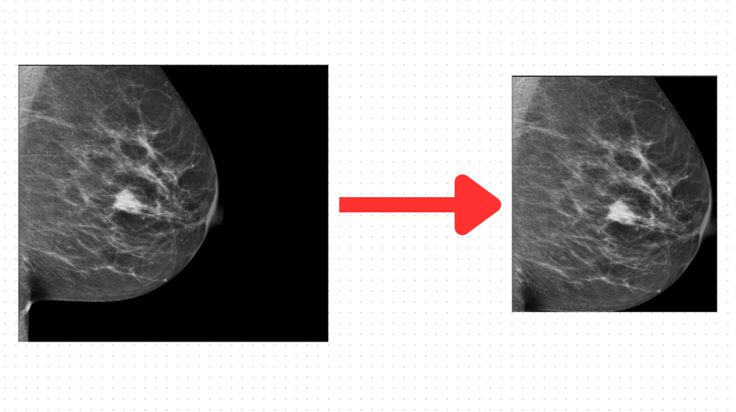

# Mammography Breast Region Detection with YOLOv8

## About the Project

This project aims to detect the breast region in mammography images using the YOLOv8 object detection model. The YOLOv8 model is a state-of-the-art deep learning algorithm that can accurately identify and localize objects in images. By applying this model to mammography images, we can automatically pinpoint the breast area, which is crucial for medical diagnosis and analysis.

## Dataset

To train and evaluate the YOLOv8 model, we used a large dataset of mammography images. Due to privacy and copyright concerns, we cannot provide the original dataset directly in this repository. However, you can easily find publicly available mammography datasets or obtain permission to use proprietary datasets for research purposes.

## Model Training

To train the YOLOv8 model, you can follow these steps:

1. Prepare the dataset: Organize your mammography images and annotation files in the YOLO format (e.g., using .txt files with one row per object).
2. Install dependencies: Ensure you have the required libraries and frameworks installed, such as PyTorch, OpenCV, and NumPy.
3. Configure YOLOv8: Set the hyperparameters, number of classes, and other configurations in the YOLOv8 configuration files to suit your dataset.
4. Train the model: Run the training script, providing the path to the configuration files and dataset.

## Model Inference

After training, you can use the YOLOv8 model to detect breast regions in new mammography images. Here's how to do it:

1. Load the trained model weights.
2. Preprocess the mammography image for inference (e.g., resizing, normalization).
3. Pass the preprocessed image through the YOLOv8 model.
4. Process the model's output to extract bounding box coordinates of the detected breast regions.

## Evaluation

To evaluate the model's performance, you can use standard object detection metrics such as mean Average Precision (mAP) and Intersection over Union (IoU). You can also visually inspect the model's detections on a validation dataset to get a better understanding of its performance.

## Usage

In this repository, we provide the necessary code for model training and inference, along with an example notebook demonstrating the detection process on sample mammography images. Please ensure you have the required dependencies installed before running the code.

## Limitations

Although the YOLOv8 model performs well in detecting breast regions, it may have limitations, such as false positives or false negatives. Therefore, it is crucial to validate the model's results and not solely rely on the AI predictions for medical diagnosis.

## Contributing

We welcome contributions to enhance the model's accuracy, efficiency, and generalization. If you find any issues or have ideas for improvement, feel free to open an issue or submit a pull request.

